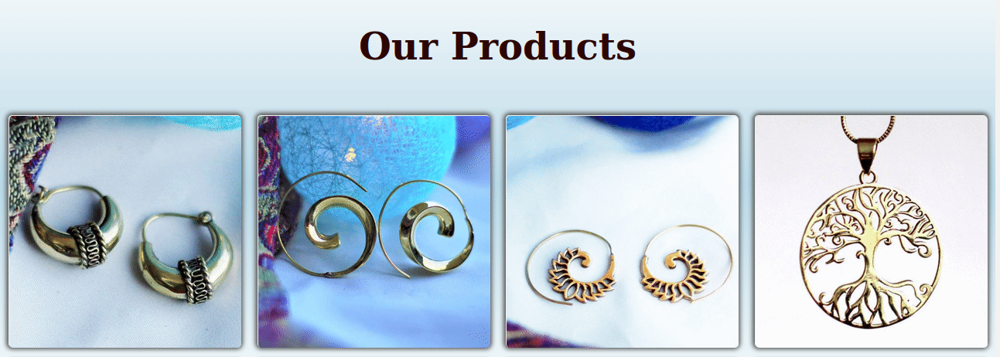
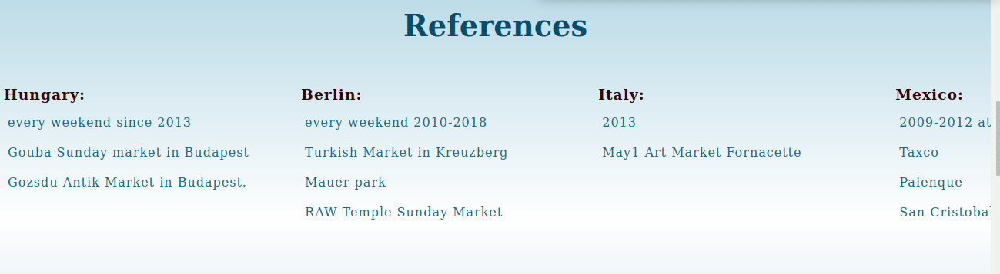
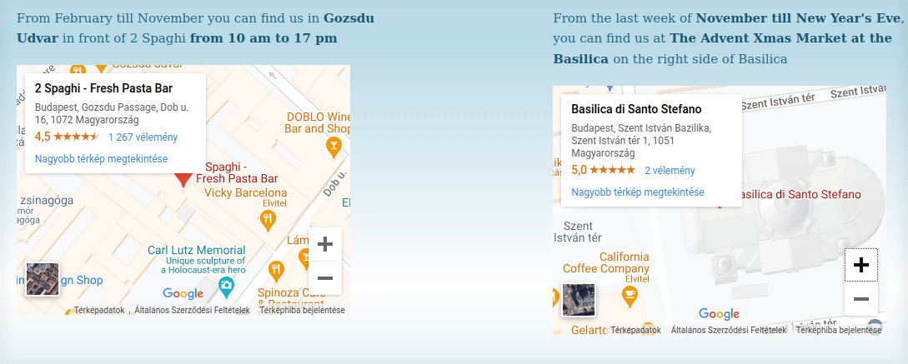

## ZoalNomad-Portfolio

<!-- PROJECT LOGO -->
 

  

 HTML, CSS, JS6

***
This portfolio is made to apply for markets and festivals to sell their products.
On the site I list all what is needed for the application.
***
### Insights

  

 

#### Photos of products

  

 

#### Photos of stand on different events

  

 

#### References

  

 

#### Location and time of the market

  

 

#### Link to webshop

  

 
